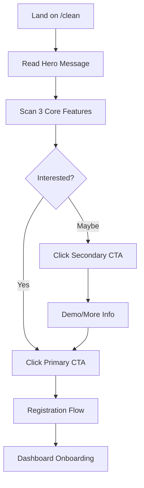
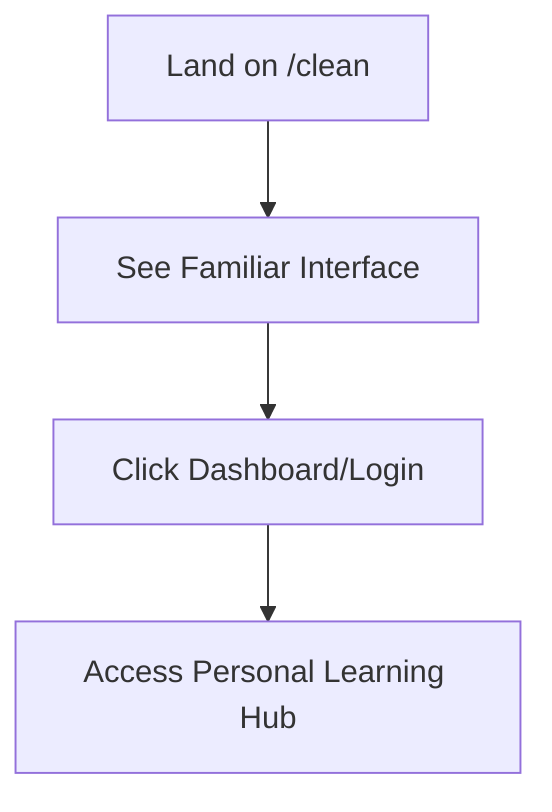

# Alternative Homepage Design Specification

## 🎯 Executive Summary

**Goal**: Create a modern, clean SaaS-style landing page to replace the current cluttered homepage (1,422 lines → ~400 lines)

**Target**: Convert visitors to users with focused messaging and clear value proposition

**Route**: `/clean` - Alternative homepage for A/B testing

---

## 📐 Design Architecture

### Layout Structure
```
┌─────────────────────────────────────────────────┐
│  Hero Section (60vh)                            │
│  ├─ Navigation (inherited from layout)          │
│  ├─ Headline: "Master Python Through Gaming"   │
│  ├─ Subtext: Clear value proposition            │
│  ├─ Primary CTA: "Start Learning Free"         │
│  └─ Hero Visual: Code snippet or demo          │
├─────────────────────────────────────────────────┤
│  Core Features (3 columns on desktop)          │
│  ├─ 🏆 Interactive Code Arena                   │
│  ├─ 🎮 Gamified Learning System                │
│  └─ 📈 Progress Tracking & Achievements        │
├─────────────────────────────────────────────────┤
│  Social Proof (optional, minimal)              │
│  ├─ User count or completion stats             │
│  └─ Single testimonial or achievement          │
├─────────────────────────────────────────────────┤
│  Final CTA Section                             │
│  ├─ Secondary headline                         │
│  ├─ Supporting benefits                        │
│  └─ CTA: "Join Thousands Learning Python"      │
└─────────────────────────────────────────────────┘
```

### Visual Design System

#### Typography
- **Headline**: Inter/Geist 48px (mobile: 32px) - Bold, high contrast
- **Subtext**: 18px (mobile: 16px) - Medium weight, readable
- **Feature text**: 16px - Regular weight, sufficient contrast
- **Line height**: 1.5-1.6 for optimal readability

#### Color Palette (Simplified)
```css
--primary: #3b82f6    /* Clean blue */
--secondary: #8b5cf6  /* Accent purple */
--success: #10b981    /* Green for CTAs */
--text-primary: #111827
--text-secondary: #6b7280
--background: #ffffff
--surface: #f9fafb
```

#### Spacing System
```css
--space-xs: 0.5rem    /* 8px */
--space-sm: 1rem      /* 16px */
--space-md: 2rem      /* 32px */
--space-lg: 4rem      /* 64px */
--space-xl: 6rem      /* 96px */
```

---

## 🎨 Component Design Specifications

### Hero Section
```typescript
interface HeroSection {
  headline: "Master Python Through Interactive Challenges"
  subtext: "Join thousands of developers learning Python with our gamified platform. Collect cards, earn badges, and build real skills."
  primaryCTA: {
    text: "Start Learning Free"
    action: "/register" | "/dashboard" (based on auth)
    style: "primary-gradient-button"
  }
  secondaryCTA: {
    text: "Watch Demo"
    action: "#demo-section" | "/code-arena"
    style: "outline-button"
  }
  visual: "Clean code snippet animation or dashboard preview"
}
```

### Core Features
```typescript
interface Feature {
  icon: LucideIcon
  title: string
  description: string
  stats?: string
}

const features: Feature[] = [
  {
    icon: Gamepad2,
    title: "Interactive Code Arena",
    description: "Practice Python with real-time challenges, instant feedback, and multiplayer competitions.",
    stats: "50+ challenges"
  },
  {
    icon: Trophy,
    title: "Gamified Learning",
    description: "Collect anime cards, earn XP, unlock achievements, and climb leaderboards while mastering Python.",
    stats: "200+ rewards"
  },
  {
    icon: TrendingUp,
    title: "Track Your Progress",
    description: "Monitor your learning journey with detailed analytics, skill assessments, and personalized recommendations.",
    stats: "Real-time insights"
  }
]
```

### Social Proof
```typescript
interface SocialProof {
  userCount: "5,000+" // Dynamic from API
  completionRate: "89%" // Dynamic from API
  testimonial?: {
    text: string
    author: string
    role: string
  }
}
```

---

## 📱 Responsive Design Strategy

### Breakpoints
```css
/* Mobile First Approach */
sm: 640px   /* Small tablets */
md: 768px   /* Tablets */
lg: 1024px  /* Small desktop */
xl: 1280px  /* Large desktop */
```

### Mobile Layout (< 768px)
- Single column layout
- Hero section: 50vh height
- Features: Stacked vertically with icons on left
- CTAs: Full width with proper touch targets (min 44px)
- Reduced spacing and font sizes

### Desktop Layout (≥ 768px)
- Hero: Side-by-side content and visual
- Features: 3-column grid
- Generous whitespace
- Larger typography and spacing

---

## ⚡ Performance Optimizations

### Code Splitting
- Lazy load non-critical sections
- Dynamic imports for heavy components
- Progressive enhancement

### Image Optimization
- WebP format with fallbacks
- Responsive images with `next/image`
- Preload critical images

### Core Web Vitals Targets
- **LCP**: < 2.5s (Hero section optimized)
- **FID**: < 100ms (Minimal JavaScript)
- **CLS**: < 0.1 (Reserved space for all elements)

---

## 🔄 User Experience Flow

### First-Time Visitor Journey


### Returning User Journey


### Key Interaction Points
1. **Hero CTA**: Primary conversion point
2. **Feature Cards**: Education and engagement
3. **Social Proof**: Trust building
4. **Final CTA**: Last conversion opportunity

---

## 🛠️ Technical Implementation Plan

### Component Structure
```
/app/clean/
├── page.tsx                 # Main landing page
├── components/
│   ├── HeroSection.tsx      # Hero with CTAs
│   ├── FeatureGrid.tsx      # 3-column features
│   ├── SocialProof.tsx      # Stats and testimonials
│   └── FinalCTA.tsx         # Bottom conversion section
└── styles/
    └── clean-landing.css    # Custom styles if needed
```

### State Management
```typescript
interface LandingPageState {
  userStats?: {
    totalUsers: number
    completionRate: number
  }
  isLoading: boolean
  error?: string
}
```

### API Integration
- Fetch real-time user statistics
- A/B test tracking integration
- Analytics event tracking

---

## 📊 Success Metrics

### Primary KPIs
- **Conversion Rate**: Registration completion from /clean
- **Bounce Rate**: < 40% (vs current homepage)
- **Time on Page**: > 2 minutes average
- **CTA Click Rate**: > 15% on primary CTA

### Secondary Metrics
- **Page Load Speed**: < 2s LCP
- **Mobile Experience**: < 5% mobile bounce rate increase
- **User Feedback**: Qualitative feedback on clarity

### A/B Testing Plan
- **Control**: Current homepage (/)
- **Variant**: New clean design (/clean)
- **Traffic Split**: 50/50 for authenticated users
- **Duration**: 2-week test period
- **Sample Size**: Minimum 1,000 visitors per variant

---

## 🚀 Implementation Phases

### Phase 1: Core Component Development
- [ ] Create `/app/clean/page.tsx` with basic structure
- [ ] Implement HeroSection component
- [ ] Build FeatureGrid with responsive design
- [ ] Add basic styling and responsive behavior

### Phase 2: Enhanced Features
- [ ] Integrate real-time statistics API
- [ ] Add SocialProof component
- [ ] Implement FinalCTA section
- [ ] Performance optimization pass

### Phase 3: Testing & Refinement
- [ ] Cross-browser testing
- [ ] Mobile device testing
- [ ] Performance auditing
- [ ] Accessibility compliance check

### Phase 4: Launch & Monitor
- [ ] Deploy to production
- [ ] Set up A/B testing infrastructure
- [ ] Monitor conversion metrics
- [ ] Gather user feedback

---

## 🎯 Content Strategy

### Headline Options (A/B Test)
1. "Master Python Through Interactive Challenges"
2. "Learn Python While Collecting Anime Cards"
3. "Gamified Python Learning for Modern Developers"

### Value Propositions
- **Primary**: Learn faster through gamification
- **Secondary**: Build real skills, not just knowledge
- **Tertiary**: Join a community of passionate learners

### Call-to-Action Variations
- **Primary**: "Start Learning Free" / "Begin Your Journey"
- **Secondary**: "Watch Demo" / "See How It Works" / "Try Sample Challenge"

---

## 📝 Development Notes

### Required Dependencies
- Existing project dependencies (React, Next.js, Tailwind)
- Lucide React icons (already installed)
- No new external dependencies needed

### Accessibility Considerations
- ARIA labels for interactive elements
- Keyboard navigation support
- High contrast color ratios (WCAG AA)
- Screen reader friendly content structure

### SEO Optimization
- Semantic HTML structure
- Meta tags for social sharing
- Structured data markup
- Fast loading for better search rankings

---

## 🔄 Future Iterations

### Post-Launch Improvements
1. **Personalization**: Show relevant features based on user type
2. **Animation**: Subtle entrance animations for engagement
3. **Interactive Demo**: Embedded code challenges in hero
4. **Social Features**: Real user activity feed
5. **Localization**: Multi-language support

### Advanced Features
- **Dynamic Content**: Personalized messaging based on traffic source
- **Progressive Web App**: Enhanced mobile experience
- **Voice Interface**: Accessibility enhancement
- **AI Recommendations**: Personalized learning paths

---

This specification provides the complete blueprint for creating a modern, conversion-focused alternative homepage that addresses the information overload issues of the current design while maintaining the core value proposition of the Zumenzu platform.