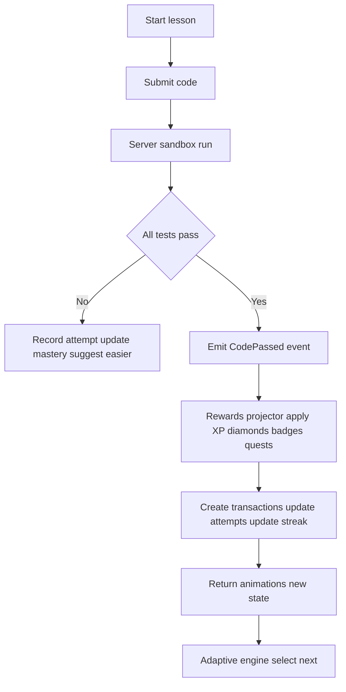

# Python Learning Platform: Gamification Evaluation and Roadmap

Objective: build a world-class Python learning platform that merges deep pedagogy with sticky gamification and a scalable monetization engine. This document captures the current state, gaps, and a prioritized plan.

Evidence reviewed (source files)

- [prisma/schema.prisma](prisma/schema.prisma)
- [src/app/api/achievements/route.ts](src/app/api/achievements/route.ts)
- [src/app/api/daily-login/route.ts](src/app/api/daily-login/route.ts)
- [src/app/api/daily-quests/route.ts](src/app/api/daily-quests/route.ts)
- [src/app/api/lessons/route.ts](src/app/api/lessons/route.ts)
- [src/app/api/code-arena/[slug]/route.ts](src/app/api/code-arena/[slug]/route.ts)
- [src/app/api/code-arena/[slug]/code-complete/route.ts](src/app/api/code-arena/[slug]/code-complete/route.ts)
- [scripts/migrations/backfill-learning-activity-slugs.ts](scripts/migrations/backfill-learning-activity-slugs.ts)
- [src/scripts/seed-lessons.ts](src/scripts/seed-lessons.ts)

Executive assessment

- Strengths
  - Rich game economy and learning entities already modeled in [prisma/schema.prisma](prisma/schema.prisma): badges, user badges, daily login, daily mini quiz, weekly challenges, XP events, diamonds, diamond transactions, learning activities and attempts.
  - The learning activity and attempt abstraction provides a unified backbone for lessons, coding exercises, and quizzes.
  - Transactional updates present in code-completion flow reduce partial-state risks.
- Critical risks
  - Client-trust on scoring and completion enables reward farming and fraud in [src/app/api/code-arena/[slug]/code-complete/route.ts](src/app/api/code-arena/[slug]/code-complete/route.ts) and [src/app/api/code-arena/[slug]/route.ts](src/app/api/code-arena/[slug]/route.ts).
  - Mixed authentication patterns: NextAuth vs custom JWT cookies across routes ([src/app/api/daily-login/route.ts](src/app/api/daily-login/route.ts), [src/app/api/daily-quests/route.ts](src/app/api/daily-quests/route.ts)).
  - Achievements endpoint is mocked and not wired to database tables in [src/app/api/achievements/route.ts](src/app/api/achievements/route.ts).
  - Adaptive learning and mastery tracking are not yet implemented; prerequisites exist but not enforced in flows.
  - Monetization strategy lacks gated value design and pricing segmentation despite diamond package structures.

High-priority recommendations

- Server-side authoritative scoring
  - Run user Python code on the server against deterministic and hidden tests; never accept client-provided scores or rewards. Store execution logs and enforce CPU and memory limits.
- Central Rewards Service
  - One authoritative module to grant XP, diamonds, badges, streaks, and quest progress with idempotency and rate limits. All endpoints call this module; remove scattered increments.
- Event-driven architecture with outbox
  - Emit ActivityCompleted, CodePassed, QuizPassed events; project rewards once via a processor. Use an outbox table for reliability and analytics.
- Authentication unification
  - Standardize to NextAuth on all APIs; deprecate custom JWT path on daily login and daily quests or issue verified short-lived tokens from the auth server.
- Real achievements engine
  - Replace mock data with a rules engine backed by the badges tables; evaluate on domain events and persist progress.
- Progression and pedagogy
  - Enforce prerequisites and mastery gates; add a skill taxonomy and per-skill mastery tracking; feed an adaptive engine to select the next best activity.
- Economy and monetization
  - Pro subscription for premium value: AI mentor feedback, solution walkthroughs, extra runs, premium-only challenges, priority support. Use diamonds for cosmetics, hints, skip tokens; add geo-aware pricing and anti-inflation sinks.
- Anti-abuse and observability
  - Idempotency keys, per-user and per-IP rate limits, replay protection, suspicious-pattern flags; structured logs and tracing across API and runner.

Selected decision for MVP scoring

- Use a third-party code execution API now to implement server-side authoritative scoring in 1 to 2 days, and plan migration to an in-house sandbox later.

Proposed secure core loop

Roadmap and acceptance criteria

- Phase 0: Auth unification
  - Migrate daily login and daily quests to NextAuth; remove custom JWT cookie validation.
  - Acceptance: All protected routes require NextAuth; E2E tests cover daily login, daily quests, lessons, and code-complete.
- Phase 1: Rewards Service and events
  - Extract all reward logic into a single module; add an outbox and a rewards projector; make grants idempotent.
  - Acceptance: No duplicate rewards under concurrent requests; DiamondTransaction and attempts are consistent and atomic.
- Phase 2: Server-side scoring via third-party runner
  - Integrate a code execution API; backend computes score and emits events; reject client-provided scores.
  - Acceptance: Hidden tests applied; resource limits enforced; clients cannot change score or rewards.
- Phase 3: Achievements engine
  - Replace mock achievements with DB-backed rules and progress persistence; evaluate on events.
  - Acceptance: Achievements list reflects database state; hidden achievements unlock correctly.
- Phase 4: Mastery and adaptive learning
  - Enforce prerequisites and minimum score gates; add a user-skill mastery model; implement adaptive next-step API.
  - Acceptance: Locked lessons behave correctly; adaptive engine recommends based on mastery and performance.
- Phase 5: Monetization v1
  - Gate premium features under Pro; add diamonds sinks and region-based pricing; add basic referral growth loop with anti-abuse.
  - Acceptance: Server-side checks enforce Pro gates; pricing respects locale; referral rewards are rate-limited.

Risks and mitigations

- Reward inflation due to multiple earning channels
  - Add sinks, cap certain daily earnings, and run economy health dashboards.
- Timezone and streak edge cases
  - Normalize all date logic to user timezone policies; add tests for boundaries and DST.
- Fraud attempts on completions
  - Enforce server-side scoring, idempotency, and rate limits; flag anomalies for review.

Key KPIs to track

- Activation: D0 and D1 lesson completion rate
- Retention: 7-day retention and streak adherence
- Engagement: average daily study minutes, DAU and WAU
- Monetization: conversion to Pro, ARPDAU, LTV, diamond sinks vs sources
- Integrity: flagged-cheat rate, duplicate-reward prevention rate

Implementation checklist

- Audit and mapping
  - Enumerate all places that modify XP, diamonds, badges, streaks, and quests.
- Authentication
  - Standardize on NextAuth for daily login and quests.
- Rewards Service
  - Centralize reward logic with idempotency and rate limits.
- Events and outbox
  - Emit and process domain events; persist in an outbox table.
- Third-party code execution integration
  - Backend runs code, computes score, and triggers events; remove client score trust.
- Achievements engine
  - Wire to badges tables in the schema with progress rules.
- Mastery and adaptive
  - Add skill taxonomy, mastery tracking, and adaptive next recommendations.
- Monetization
  - Pro feature gates; diamonds sinks; region-aware pricing.
- Anti-abuse
  - Idempotency keys, rate limits, replay protection, suspicious-pattern flags.
- Analytics
  - Central event table and dashboards for activation, retention, conversion, and economy health.
- QA and load
  - Idempotency tests, streak edge cases, sandbox resource limits, and chaos tests.

Current project references

- Schema: [prisma/schema.prisma](prisma/schema.prisma)
- Lessons list: [src/app/api/lessons/route.ts](src/app/api/lessons/route.ts)
- Lesson view and progress: [src/app/api/code-arena/[slug]/route.ts](src/app/api/code-arena/[slug]/route.ts)
- Code completion flow: [src/app/api/code-arena/[slug]/code-complete/route.ts](src/app/api/code-arena/[slug]/code-complete/route.ts)
- Daily login: [src/app/api/daily-login/route.ts](src/app/api/daily-login/route.ts)
- Daily quests: [src/app/api/daily-quests/route.ts](src/app/api/daily-quests/route.ts)
- Achievements API: [src/app/api/achievements/route.ts](src/app/api/achievements/route.ts)
- Content seeding: [src/scripts/seed-lessons.ts](src/scripts/seed-lessons.ts)
- Slug backfill: [scripts/migrations/backfill-learning-activity-slugs.ts](scripts/migrations/backfill-learning-activity-slugs.ts)

Decisions to confirm before implementation

- Third-party runner vendor for MVP and required quotas
- Pro feature gating list and pricing strategy per region
- Initial set of achievements to implement and their rules

End of document
