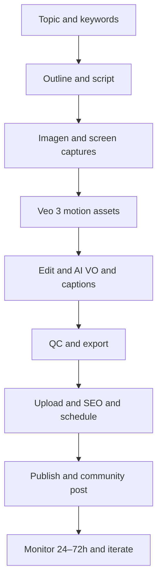

# Zumenzu YouTube Channel Strategy — Global English

Executive strategy for a faceless, AI‑voiced, education‑first channel. Cadence: 2 long videos per month (12–16 min) + 8 Shorts per month (30–60 s). Visuals generated with Google Imagen 3.0 and Veo 3; screen captures from product; minimal camera footage.

References

- Product visuals prompt pack: [docs/marketing/imagen-prompts.md](docs/marketing/imagen-prompts.md)
- Promo video prompt pack: [docs/marketing/veo3-prompts.md](docs/marketing/veo3-prompts.md)

1. Positioning and Audience

- Brand: Zumenzu — interactive Python learning platform with Code Arena, multi‑activity lessons, daily quests, XP/badges, diamonds, card packs, dashboard, daily tips.
- Audience: global beginners to intermediate developers, CS students, bootcamp grads, career switchers, junior data/ML aspirants.
- Promise: Learn Python. Level up. Build skills via interactive challenges and daily progression.
- Voice: Friendly, concise, confident; no face; AI voiceover in neutral US or UK accent; English captions burned‑in.

2. Channel name, handle, and description

Recommended picks

- Channel name: Zumenzu
- Handle options: @zumenzu (preferred), @zumenzuPython, @zumenzuAcademy, @LearnPythonZumenzu
- Backup names if handle unavailable: Zumenzu Labs, Zumenzu Code Arena, Zumenzu Academy, Python Level Up by Zumenzu, CodeQuest by Zumenzu

About description (copy‑paste)

Learn Python. Level up. Zumenzu is an interactive platform with Code Arena challenges, multi‑format lessons, daily quests and streaks, XP and badges, and a clean progress dashboard. New tutorials and Shorts each month. Start free at zumenzu.com

Links: website, docs, blog, community, X, LinkedIn, Discord. Keep the first link as Start free.

3. Visual identity kit

- Colors: Electric cyan #00E5FF, violet #7C4DFF; charcoal backgrounds #0F1115–#121318; white text #FFFFFF; success green #00C853.
- Typography: Inter or Manrope for headings; JetBrains Mono for code overlays.
- UI motifs: code editor panels, green pass checks, terminal lines, activity tiles, quest cards, streak flame, badges row, diamonds, simple charts, VS Code‑like tip widget.
- Do not include real brand logos or copyrighted characters.

4. Channel assets — ready‑to‑use prompts

4.1 Channel avatar/logo (Imagen)

Goal: square 1024×1024 profile; neon‑edge glyph that reads at 48 px.

Prompt

Minimal geometric logo mark for a modern Python learning platform named Zumenzu. Dark charcoal background, matte black rounded square tile with subtle bevel. Center a clean Z monogram formed by two angled neon strokes with electric cyan #00E5FF and violet #7C4DFF, slight outer glow, no text. Add a faint grid or code‑pane lines for context. Photorealistic 3D + UI hybrid, crisp edges, premium lighting. No brand logos. No human faces.

Parameters

- Model: imagen‑3.0‑generate‑001
- Size: 1024×1024 and 800×800
- Variations: 4; freeze best seed
- Negative: no logos, no text, no IP, no faces, no oversaturation

Export: PNG with transparent‑capable background if offered; otherwise solid charcoal.

4.2 Channel banner (Imagen)

Specs: 2560×1440; safe text/logo area 1235×338 centered. Keep textless; overlay in editor.

Prompt

Clean 16:9 YouTube channel banner for an interactive Python platform. Dark premium UI collage: left third shows a code editor with pass checks and a compact terminal; right two‑thirds show activity tiles (quiz, memory, drag‑drop, fill blanks), a quest card complete tick, a streak counter, a slim badge row, small diamonds and a rising line chart. Cyan #00E5FF and violet #7C4DFF accent glows. Photorealistic UI/3D hybrid with soft parallax and particles. No embedded text. No logos. Leave central safe area uncluttered.

Parameters

- Model: imagen‑3.0‑generate‑001
- Size: 2560×1440
- Variations: 4
- Negative: global negatives above

  4.3 Thumbnail background set (Imagen)

Goal: reusable 16:9 backplates with depth.

Prompt

Dark UI backplate for Python tutorial thumbnail. 16:9 canvas with angled panels: code editor close‑up, pass checks, terminal strip, activity tile and a subtle grid. Cyan/violet rim lights, soft bokeh particles, generous negative space on the left for bold text. Photorealistic, crisp, high contrast, no embedded text, no brand logos.

Parameters: 3840×2160, 4 variations; export JPG. Keep a few variants with brighter cyan area for white text.

Text overlay style

- 3–5 words max, 2‑line stack; big, white, high contrast; subtle cyan stroke.
- Use action verbs: Build, Decode, Master, Fix, Optimize.
- Add a small corner badge (Code Arena, Tips, Algorithms, Project).

  4.4 Motion package (Veo 3)

5 s intro (no VO)

Modern intro animation for an interactive Python platform named Zumenzu. Panels slide in: code editor with green checks, activity tiles illuminate, quest card ticks complete, badge row glints, diamonds sparkle subtly. Cyan #00E5FF and violet #7C4DFF accents, dark UI, subtle particles. Smooth parallax camera, no jitter, minimal motion blur. End on a clean lockup space for the wordmark and episode title (overlay later).

Parameters: 16:9, 5 s, 30 fps, loop false; negative prompts as above.

1.5 s transition

Quick wipe via a glowing cyan strip revealing the next scene; faint grid and particle trail; clean, minimal.

5 s outro (CTA)

Outro animation that echoes the intro; UI panels drift to reveal a dark area with large CTA overlays: Subscribe • Start free • Next video. Keep motion calm; maintain brand colors; no VO.

Lower‑third

Minimal lower‑third strap slides in from left with cyan underline and violet glow; place for section title like Code Arena or Algorithm Insight; 1.2 s in/out.

Background loops

8–10 s subtle loop of UI panels drifting horizontally; perfect loop; use for cold opens, end screens, and Shorts background.

Delivery: export at 3840×2160; if alpha not supported, render on pure green for chroma key, or on black and use luma key.

4.5 End screen background (Imagen)

1920×1080 cinematic dark plate with safe zones for two video cards on the left and a subscribe circle on the right; keep glow elements and a faint grid.

5. Content pillars

- Interactive Python fundamentals via Code Arena challenges
- Algorithms and data structures visualized
- Practical automation and scripting mini‑projects
- Daily Python Tip (Shorts‑first; compile to monthly long‑form)
- Learning systems and progress: quests, streaks, badges

6. Programming and calendar (90 days)

Cadence rules

- Long videos: publish on the 2nd and 4th Tuesday monthly at 16:00 UTC.
- Shorts: two per week, Tue and Fri at 16:00 UTC.
- Community post every Wed with poll or tip.

Rolling 12‑week schedule

- Week 1: Shorts ×2; community poll.
- Week 2: Long video #1; Shorts ×2.
- Week 3: Shorts ×2; community tip.
- Week 4: Long video #2; Shorts ×2.
- Repeat Weeks 5–8 and 9–12 with the same cadence, adjusting topics per performance.

7. Episode blueprints (long‑form)

Blueprint A — Code Arena Journey (12–14 min)

- 0:00 Hook: the challenge and the prize
- 0:20 Why it matters
- 1:10 Plan: steps to solve
- 2:00 Solve Part 1 in Code Arena
- 5:00 Pattern interrupt: quick fact or visual gag
- 5:15 Solve Part 2 and tests pass
- 9:00 Apply to a real‑world snippet
- 11:00 Recap, next challenge, CTA

Blueprint B — Algorithms Visualized (12–16 min)

- 0:00 Visual cold open (before/after)
- 0:25 Intuition first: what, why, trade‑offs
- 2:00 Step demo with visuals
- 6:00 Code walkthrough highlights (no wall of code)
- 10:00 Performance and pitfalls
- 13:00 Apply + CTA

8. Shorts pack (8 per month)

Use consistent format: Hook ≤1.5 s → Demo 20–30 s → Payoff 5–8 s → CTA ≤2 s.

Examples (scripts and on‑screen text)

- Short 1: Speed up Python loops with enumerate
  Hook: Stop using range for indexes
  Demo: Show enumerate with index, value; Code Arena green checks
  Payoff: Cleaner, faster iteration
  CTA: Learn Python. Level up.

- Short 2: List comprehension vs map
  Hook: One line beats for‑loops
  Demo: Compare list comp and map; tiny timing hint
  Payoff: Readable and pythonic
  CTA: Try Code Arena.

- Short 3: Dict get with default
  Hook: No more KeyError
  Demo: show .get with default fallback
  Payoff: Safer lookups
  CTA: Free daily tips.

- Short 4: Unpacking tricks
  Hook: Swap two vars without temp
  Demo: a, b = b, a; star‑unpack
  Payoff: Cleaner swaps
  CTA: Subscribe.

- Short 5: Slicing power
  Hook: Reverse a list in 1 char
  Demo: my_list[::-1]
  Payoff: Quick reversals
  CTA: More tips weekly.

- Short 6: Pathlib over os.path
  Hook: Ditch string paths
  Demo: Path objects, joins, exists
  Payoff: Cleaner file IO
  CTA: Level up.

- Short 7: Dataclass basics
  Hook: Stop writing boilerplate
  Demo: dataclass fields and init
  Payoff: Fewer lines
  CTA: Build with us.

- Short 8: Virtualenv in 10s
  Hook: Isolate your deps
  Demo: python -m venv .venv → activate → pip freeze
  Payoff: Clean projects
  CTA: Next challenge awaits.

9. SEO and metadata templates

Title formulas

- Master Python X in Y minutes — real challenges, no fluff
- I built X with Python — from idea to tested code
- Python algorithms explained visually — X vs Y
- Daily Python Tip: X in 30 seconds

Description skeleton (long form)

1–2 sentence hook. What you will learn. Timestamps. Links: Start free, related lessons, playlist. Tools: Python, Zumenzu. Chapters:

00:00 Hook
00:20 Why it matters
01:10 Plan
02:00 Demo
09:00 Apply
11:00 Recap and next

Hashtags: #python #learnpython #coding #algorithms #datastructures #codearena #zumenzu

End screens: next episode + playlist; cards: link to Code Arena demo at minute 2:30.

10. Publishing SOP (per video)

- Ideate topic aligned to pillars and keywords
- Outline and script (English)
- Generate visuals (Imagen backplates, product captures)
- Render motion assets (Veo 3 intro, lower‑thirds, transitions)
- Record AI VO; add captions
- Edit and sound design; add end screen and cards
- QC checklist: facts, pacing, music, spelling, safe margins
- Upload, metadata, schedule
- Publish day: pin comment, community post, cross‑post to X/LinkedIn, embed on website/blog
- 72‑hour follow‑up: reply to comments, add chapters, test alternate thumbnail/title if CTR low

Production pipeline diagram

11. Growth and distribution

- Website: embed videos in relevant docs and blog posts; add Start free CTA below
- Email: weekly roundup with latest video and two Shorts
- Community: monthly live AMA via chat overlay without face
- Social: X thread with code snippets; LinkedIn carousel with key frames
- Collabs: guest Shorts with other Python educators; cross‑link playlists
- Reddit/Forums: share helpful clips in r/learnpython, include summary and code gist

12. Analytics and targets

- Thumbnails CTR: 6–10% (Shorts uses view duration)
- Average view duration (long): 40–50%
- Shorts VTR: 85%+
- Watch time month 1: 30–60 hours; month 3: 150–250 hours
- Website clicks from YouTube: baseline 1–3%; aim for 5% by month 3
- Email signups per video: 0.5–1.5%

13. Risks and mitigations

- Risk: Over‑polished assets delay publishing → Mitigation: lock 1‑day edit cap per long, 2‑hour cap per Short
- Risk: Topic misses demand → Mitigation: keyword pre‑check and community polls
- Risk: Low CTR → Mitigation: A/B thumbnail and title within 48 hours
- Risk: Retention dips → Mitigation: add pattern interrupts at minutes 1:30, 5:00, 8:00

14. Approval checklist

- Pick channel name and handle
- Approve avatar and banner
- Approve intro/outro styles
- Approve first month’s 2 long video titles and 8 Shorts topics
- Approve SEO templates

Project todo checklist

- [ ] Secure handle on YouTube and socials
- [ ] Generate and upload avatar
- [ ] Generate and upload banner
- [ ] Render intro, transitions, outro, lower‑thirds
- [ ] Build thumbnail template in Figma/Canva
- [ ] Finalize month 1 titles and scripts (2 long, 8 Shorts)
- [ ] Produce month 1 assets and schedule
- [ ] Set channel layout, playlists, featured video
- [ ] Wire growth loop on website and email
- [ ] Configure analytics dashboard and weekly review

Appendix links

- Imagen product visuals: [docs/marketing/imagen-prompts.md](docs/marketing/imagen-prompts.md)
- Veo 3 promo prompts: [docs/marketing/veo3-prompts.md](docs/marketing/veo3-prompts.md)
