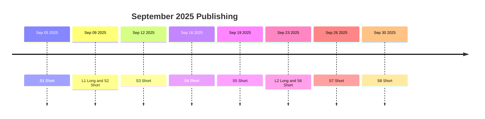

# Zumenzu YouTube Month-1 Content Pack — Global English

Production-ready scripts, prompts, SEO and calendar for 2 long videos + 8 Shorts.

References

- Product visuals: [docs/marketing/imagen-prompts.md](docs/marketing/imagen-prompts.md)
- Promo videos: [docs/marketing/veo3-prompts.md](docs/marketing/veo3-prompts.md)
- Strategy baseline: [docs/marketing/youtube-channel-plan.md](docs/marketing/youtube-channel-plan.md)

Channel and cadence

- Channel: Zumenzu
- Handle: @zumenzuPython
- Cadence: 2x long/month; 8x Shorts/month
- Publish time: 16:00 UTC (19:00 TRT)

Calendar — September 2025

- Fri Sep 05 — Short S1
- Tue Sep 09 — Long L1 + Short S2 (S2 at 12:00 UTC; L1 at 16:00 UTC)
- Fri Sep 12 — Short S3
- Tue Sep 16 — Short S4
- Fri Sep 19 — Short S5
- Tue Sep 23 — Long L2 + Short S6 (S6 at 12:00 UTC; L2 at 16:00 UTC)
- Fri Sep 26 — Short S7
- Tue Sep 30 — Short S8

SOP (Month‑1)

- [ ] Lock titles and thumbnails for L1, L2, S1–S8
- [ ] Render motion package (Veo 3): intro, transitions, outro, lower‑thirds, loop
- [ ] Record AI VO; export SRT captions
- [ ] Edit and sound design; add cards and end screens
- [ ] QC and schedule all uploads

===============================
Long Video L1 — Build a Python Habit Tracker — Tested in Code Arena
===============================

Title

Build a Python Habit Tracker — Tested in Code Arena

Hook (0:00–0:20)

What if you could build a real Python project and prove it works in minutes? Today we build a tiny habit tracker and run it through Code Arena tests so you leave with working, tested code.

Outline

- 0:00 Hook
- 0:20 Why this project matters
- 1:10 Plan and data model
- 2:00 Build core functions
- 5:00 Save and load from JSON
- 7:00 CLI loop and commands
- 9:00 Run tests in Code Arena
- 11:00 Real‑world extensions
- 12:30 Recap and CTA

Script (VO)

Today we will build a real Python habit tracker from scratch and verify it with tests. You will learn how to structure a small project, read and write JSON, and design functions you can reuse in bigger apps.
Projects prove skills. This tiny build touches core skills you use daily — data structures, file IO, and minimal CLIs.
Plan: define a habit structure, add and check habits, persist to disk, and add a minimal menu to interact.
We start with list-of-dicts: name, count, last_done. Then add add_habit and mark_done.
Persist to JSON so progress survives restarts.
Wrap with a small command loop: add, done, list, quit.
Jump into Code Arena to run tests for confidence and repeatability.
Extensions: streak logic, calendar view, tags, export to CSV.

Screen capture plan

- Editor: habit_tracker.py implemented step by step
- Terminal: run script; show add/done/list
- Code Arena: paste functions; run tests; show green checks

Imagen prompt — Thumbnail backplate

16:9 dark UI backplate for a Python tutorial thumbnail: code editor close‑up with green pass checks, a terminal strip, and a small checklist card icon. Cyan #00E5FF and violet #7C4DFF rim light. Generous negative space on the left for big white text. Photorealistic UI/3D hybrid, sharp edges, no embedded text, no logos.

Thumbnail text overlay

- Build a Habit Tracker
- Tested in Code Arena

Veo 3 — L1 segments

Intro 5 s: Panels slide in — editor with green pass checks, a checklist tile, subtle diamond sparkle. Dark UI, cyan/violet accents, soft particles. Smooth parallax. End on clean lockup space.
Transition 1.5 s: Cyan strip wipe with faint grid revealing the editor close‑up.
Outro 5 s: Panels drift to reveal CTA area: Subscribe • Start free • Next video.
On‑screen text: Learn Python. Level up. • Plan: data + functions + JSON • All tests passed • Subscribe • Next episode

SEO

Title: Build a Python Habit Tracker — Tested in Code Arena
Description: Build a tiny Python habit tracker, then verify it with tests in Code Arena. Learn data modeling, JSON persistence, and a minimal CLI loop. Chapters in the description.
Chapters: 00:00 Hook • 00:20 Why • 01:10 Plan • 02:00 Build • 05:00 JSON • 07:00 CLI • 09:00 Tests • 11:00 Extensions • 12:30 Recap
Tags: python, learn python, python project, code arena, json, cli, beginner python, coding
Hashtags: #python #learnpython #coding #codearena #zumenzu
Cards: at 02:30 link to Code Arena playlist
End screen: Next episode + Subscribe

===============================
Long Video L2 — Bubble vs Insertion vs Merge in Python — When to Use What
===============================

Title

Bubble vs Insertion vs Merge in Python — When to Use What

Hook (0:00–0:20)

You have more than one sorting algorithm for a reason. We compare Bubble, Insertion, and Merge with visual intuition, code highlights, and trade‑offs so you choose the right tool.

Outline

- 0:00 Hook
- 0:25 Intuition first: how they work
- 2:00 Code highlights and animations
- 6:00 Complexity and when to use
- 9:30 Demo on real arrays
- 12:00 Recap and CTA

Script (VO)

Sorting is not just about speed; it is about the right approach for your data. Bubble is simple but slow; Insertion is great for nearly‑sorted lists; Merge handles big arrays predictably.
Intuition: Bubble swaps adjacent items; Insertion grows a sorted prefix; Merge splits and merges.
We look at code highlights without drowning in text. Focus on what changes per algorithm.
Complexity: Bubble O(n^2), Insertion O(n^2) average but O(n) on nearly sorted, Merge O(n log n) with extra memory.
Demo: visually sort three arrays and show timing bars.
Recap: pick tools by data shape and constraints.

Imagen prompt — Thumbnail backplate

16:9 dark UI backplate with three vertical panels hinted by icons only: a swap pair, an insert caret, and branching merge lines. Cyan/violet glow, subtle grid, big negative space on the right for text. No embedded text, no logos.

Thumbnail text overlay

- Bubble vs Insertion vs Merge
- When to Use What

Veo 3 — L2 segments

Intro 5 s: Tiles animate — pairs swapping, an insertion caret sliding, branching merge lines. Cyan/violet accents, minimal particles, smooth parallax.
Transition 1.5 s: Grid‑lined wipe with cyan edge light into code highlight section.
Outro 5 s: Panels drift to CTA area with Subscribe • Start free • Next video.
On‑screen text: Algorithms visualized • Code highlights • Complexity and trade‑offs • Subscribe • Next episode

SEO

Title: Bubble vs Insertion vs Merge in Python — When to Use What
Description: A clear, visual comparison of Bubble, Insertion, and Merge sort in Python — intuition, code highlights, complexity, and real demos so you know which one to use and why.
Chapters: 00:00 Hook • 00:25 Intuition • 02:00 Highlights • 06:00 Complexity • 09:30 Demo • 12:00 Recap
Tags: python, algorithms, sorting, bubble sort, insertion sort, merge sort, big o, coding, learn python
Hashtags: #python #algorithms #sorting #bigO #codearena #zumenzu
Cards: at 06:10 link to Algorithms playlist
End screen: Next episode + Subscribe

===============================
Shorts S1–S8 — Scripts, prompts, SEO
===============================

Format

- Hook ≤1.5 s → Demo 20–30 s → Payoff 5–8 s → CTA ≤2 s
- On‑screen text large and crisp; add captions
- Publish at 16:00 UTC except S2 and S6 at 12:00 UTC on long‑video days

S1 — Stop using range for indexes: use enumerate

VO: Stop writing manual indexes. Use enumerate to get index and value together — cleaner, safer, often faster.
Text: enumerate beats range
Demo: for‑loop with enumerate; print index and value; Code Arena pass checks.
Veo 3: 9:16 micro tutorial; close‑up code; green pass checks; cyan/violet accents; crisp text.
Imagen: 9:16 plate with code line highlighting enumerate; cyan glow; empty top space for text.

S2 — List comprehension vs map

VO: One clean line beats three. List comprehensions are readable and pythonic; map is fine, list comps shine for simple transforms.
Text: list comp vs map
Demo: map vs list comp side by side; timing hint bar; pass checks.
Veo 3: 9:16 comparison tiles; left map, right list comp; cyan highlight moves to the winner.
Imagen: 9:16 split plate; cyan vs violet edge light; no baked text.

S3 — Dict get with default

VO: Avoid KeyError. dict.get lets you read a key with a safe default — no try‑except for simple lookups.
Text: dict.get default
Demo: dict.get with missing key returns default; tests pass.
Veo 3: 9:16 key lookup card; tiny shield icon; cyan glow; minimal particles.
Imagen: 9:16 plate with dictionary + shield motif; dark grid.

S4 — Swap variables without temp

VO: Swap two variables in one move. Python unpacking is clean and fast.
Text: swap in one line
Demo: a, b = b, a with a tiny timing bar.
Veo 3: 9:16 close‑up code tile; two values swap along a cyan path.
Imagen: 9:16 plate with swap arrows icon; cyan/violet glow.

S5 — Reverse with slicing

VO: Reverse a list in one step with slicing. No loops needed.
Text: reverse in one step
Demo: my_list[::-1] and pass checks.
Veo 3: 9:16 code tile highlights slice syntax; list reverses; cyan accent.
Imagen: 9:16 plate with brackets motif and arrow; dark UI.

S6 — Pathlib over os.path

VO: Stop juggling string paths. Pathlib gives you clean objects, joins, and checks that read like English.
Text: pathlib wins
Demo: Path objects joining, checking exists; pass checks.
Veo 3: 9:16 tiles: folder icon, check mark, code pane with Path usage.
Imagen: 9:16 plate with folder and path line icons; subtle grid.

S7 — Dataclass basics

VO: Dataclasses remove boilerplate. Define fields and you get init, repr, and comparisons for free.
Text: dataclass basics
Demo: @dataclass with two fields; instance prints nicely; tests pass.
Veo 3: 9:16 code tile; fields appear; a stamp icon implies generated methods.
Imagen: 9:16 plate with badge icon and field lines.

S8 — Virtualenv in 10 seconds

VO: Keep dependencies isolated. Create a virtual environment, activate, and freeze — fast and clean.
Text: venv in 10 s
Demo: python -m venv, activate, pip freeze; minimal terminal lines.
Veo 3: 9:16 terminal tile animating commands with cyan cursor glow.
Imagen: 9:16 plate with terminal icon and grid; cyan highlight.

Shorts SEO boilerplate

Description: A quick Python tip you can use today. Try it inside Code Arena and build your skills faster.
Tags: python, learn python, python tips, code arena, programming, developer
Hashtags: #python #shorts #coding #learnpython #codearena #zumenzu

===============================
Assets and delivery
===============================

Render list

- Imagen: avatar, banner, end screen plate, 3 backplates for thumbnails
- Veo 3: intro, transition, outro, lower‑third, loop background
- L1: thumbnail, screen captures, captions, end screen
- L2: thumbnail, screen captures, captions, end screen
- S1–S8: vertical renders and captions

File naming

- L1_2025‑09‑09_habit_tracker_thumb.jpg
- L2_2025‑09‑23_sorting_thumb.jpg
- S1_2025‑09‑05_enumerate.mp4 ... S8_2025‑09‑30_venv.mp4

Publishing reminders

- Use 16:00 UTC for all releases; 12:00 UTC for Shorts on long‑video days
- Add cards and end screens as specified
- Pin a helpful comment with code gist or link
- Community post on Wed with a poll or tip

This document lives at:

- [docs/marketing/youtube-month-1-content-pack.md](docs/marketing/youtube-month-1-content-pack.md)
